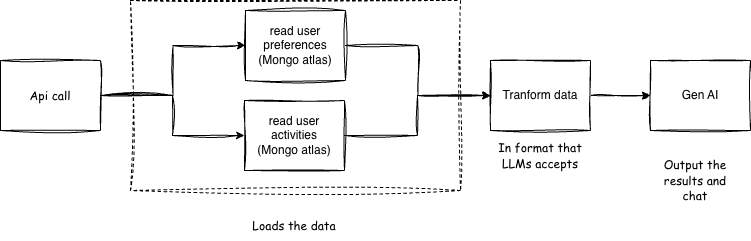

# Habit Assistant

The Habit Assistant is a personalized, AI-powered companion that helps users build and maintain better habits through human-like interactions. It automatically aggregates data from multiple apps and tools, compares real behavior against user-defined goals, and delivers weekly insights highlighting progress, gaps, and trends. Based on these insights, the assistant provides actionable recommendations and tailored tips to help users consistently move closer to their goals.

## Basic diagram

## Tech Designs

** Using n&n **

** Using Amazon Bedrock with RAG **

** Mixing AWS Services with self-hosted LLMs
